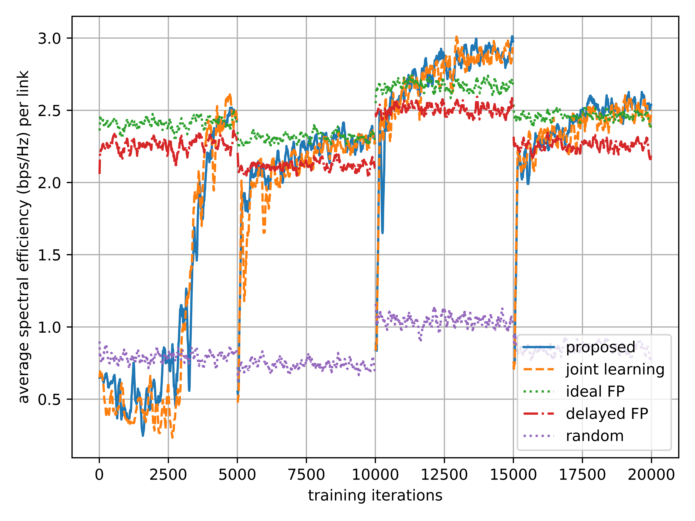
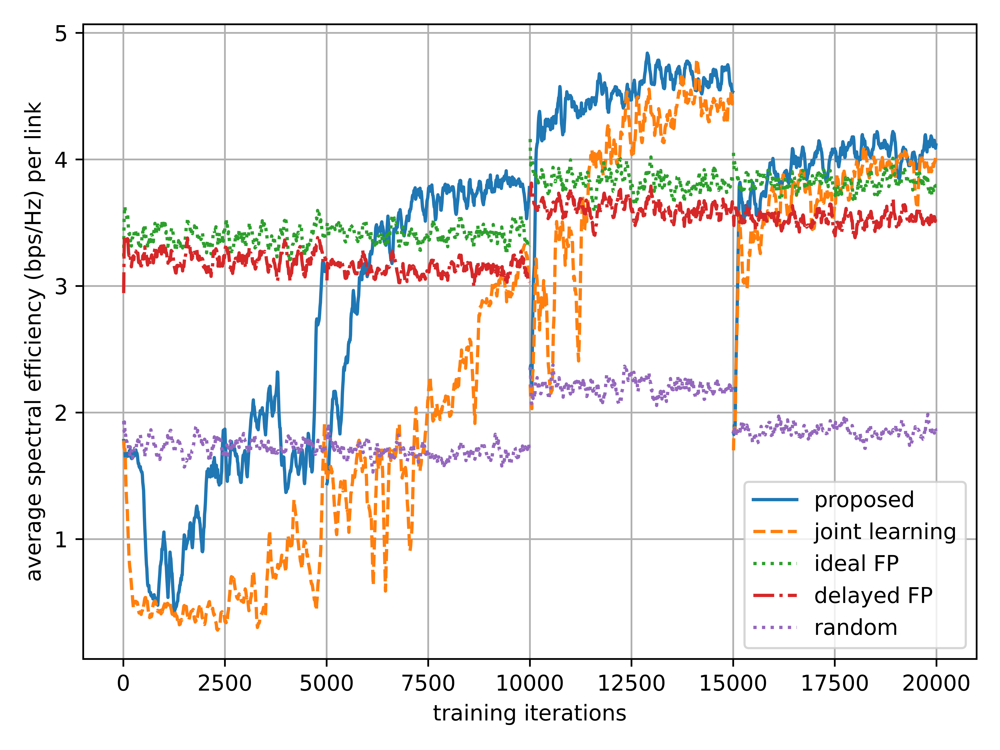

# Deep Reinforcement Learning for Joint Spectrum and Power Allocation in Cellular Networks
### Authors: Yasar Sinan Nasir and Dongning Guo
#### Please email me for any questions or comments: snasir [at] u.northwestern [dot] edu
> **Note:** Instructions are for Linux. 
> Please create a virtual environment and install the specified tensorflow and numpy versions:
> > `python3.6 -m pip install --user virtualenv` 
> > `virtualenv -p python3.6 venv` 
> > `source $HOME/venv/bin/activate` 
> > `pip install -r requirements.txt` 
#### DEMO:
The repository comes with data to reproduce immediate results, run: 
##### Reproduce Fig. 3.a: 
* > `python3 -i ./train_results.py --json-file "train_K5_N20_M2_shadow10_episode4-5000_travelIND_fd10" ` 
* **Expected Output:** 
Deployment: train_K5_N20_M2_shadow10_episode4-5000_travelIND_fd10; policy: ddpg200_100_50; K: 20; N: 5 
Averages for last 200 episodes: 
Sum rate per link - proposed: 2.54 
Sum rate per link - joint learning: 2.47 
Sum rate per link - FP: 2.42 
Sum rate per link - FP Multi delayed: 2.22 
Sum rate per link - random: 0.82 
Sum rate per link - full: 0.82 
Average FP iterations per run: 106.99 

##### Reproduce Fig. 3.b: 
* > `python3 -i ./train_results.py --json-file "train_K5_N20_M4_shadow10_episode4-5000_travelIND_fd10" ` 
* **Expected Output:** 
Deployment: train_K5_N20_M4_shadow10_episode4-5000_travelIND_fd10; policy: ddpg200_100_50; K: 20; N: 5 
Averages for last 200 episodes: 
Sum rate per link - proposed: 4.14 
Sum rate per link - joint learning: 3.96 
Sum rate per link - FP: 3.76 
Sum rate per link - FP Multi delayed: 3.53 
Sum rate per link - random: 1.85 
Sum rate per link - full: 1.85 
Average FP iterations per run: 127.75 
 

#### Reproducing Table I Row 3: (Trained policy parameters are included as well for further testing)
The repository contains the pre-trained policy parameters in ./simulations/sumrate/policy, so there is no need to run training to reproduce the results. For each row of Table I, you can execute:
* > `python3 ./test_results.py --json-file "test_K5_N20_M4_shadow10_episode10-500_travel0_fd10" --json-file-train "train_K5_N20_M4_shadow10_episode4-5000_travelIND_fd10" --json-file-PA-train "ddpg200_100_50" --json-file-CS-train "dqn100_50_50"` 
* > `python3 ./test_results.py --json-file "test_K5_N20_M4_shadow10_episode10-500_travel0_fd10" --json-file-train "train_K5_N20_M4_shadow10_episode4-5000_travelIND_fd10" --json-file-PA-train "dqn200_200_100" --json-file-CS-train "dqn200_200_100"` 
 **Expected Output:**
Test: test_K5_N20_M4_shadow10_episode10-500_travel0_fd10; train train_K5_N20_M4_shadow10_episode4-5000_travelIND_fd10; policy: ddpg200_100_50 
Sum rate per link for policy after 4 episodes: 4.57, percentage: 1.20 
Sum rate per link - FP: 3.81, percentage: 1.00 
Sum rate per link - FP w delay: 3.57, percentage: 0.94 
Sum rate per link - random: 2.12, percentage: 0.56 
Sum rate per link - full: 2.12, percentage: 0.56 
Average FP iterations per run: 122.15 
Test: test_K5_N20_M4_shadow10_episode10-500_travel0_fd10; train train_K5_N20_M4_shadow10_episode4-5000_travelIND_fd10; policy: dqn200_200_100 
Sum rate per link for policy after 4 episodes: 4.38, percentage: 1.15 
Sum rate per link - FP: 3.81, percentage: 1.00 
Sum rate per link - FP w delay: 3.57, percentage: 0.94 
Sum rate per link - random: 2.12, percentage: 0.56 
Sum rate per link - full: 2.12, percentage: 0.56 
Average FP iterations per run: 122.1 

#### Reproducing Table I Row 7: (Trained policy parameters are included as well for further testing)
The repository contains the pre-trained policy parameters in ./simulations/sumrate/policy, so there is no need to run training to reproduce the results. For each row of Table I, you can execute:
* > `python3 ./test_results.py --json-file "test_K10_N50_M5_shadow10_episode10-500_travel0_fd10" --json-file-train "train_K10_N50_M5_shadow10_episode4-5000_travelIND_fd10" --json-file-PA-train "ddpg200_100_50" --json-file-CS-train "dqn100_50_50"` 
* > `python3 ./test_results.py --json-file "test_K10_N50_M5_shadow10_episode10-500_travel0_fd10" --json-file-train "train_K10_N50_M5_shadow10_episode4-5000_travelIND_fd10" --json-file-PA-train "dqn200_200_100" --json-file-CS-train "dqn200_200_100"` 
 **Expected Output:**
Test: test_K10_N50_M5_shadow10_episode10-500_travel0_fd10; train train_K10_N50_M5_shadow10_episode4-5000_travelIND_fd10; policy: ddpg200_100_50 
Sum rate per link for policy after 4 episodes: 3.79, percentage: 1.19 
Sum rate per link - FP: 3.18, percentage: 1.00 
Sum rate per link - FP w delay: 2.94, percentage: 0.92 
Sum rate per link - random: 1.64, percentage: 0.52 
Sum rate per link - full: 1.64, percentage: 0.52 
Average FP iterations per run: 206.38 
Test: test_K10_N50_M5_shadow10_episode10-500_travel0_fd10; train train_K10_N50_M5_shadow10_episode4-5000_travelIND_fd10; policy: dqn200_200_100 
Sum rate per link for policy after 4 episodes: 3.76, percentage: 1.18 
Sum rate per link - FP: 3.18, percentage: 1.00 
Sum rate per link - FP w delay: 2.94, percentage: 0.92 
Sum rate per link - random: 1.64, percentage: 0.52 
Sum rate per link - full: 1.64, percentage: 0.52 
Average FP iterations per run: 206.38 

#### To train a policy from scratch:
We prepared a bash script file that runs all the python files required to run all simulations from scratch: 
> ./scripts/train.sh
#### Table I:
It takes several hours to complete the above script, so you can just run test scenarios by using the provided pretrained parameters. 
> `./scripts/testK5N20M1.sh`  
> `./scripts/testK5N20M2.sh`  
> `./scripts/testK5N20M4.sh`  
> `./scripts/testK10N50M1.sh`  
> `./scripts/testK10N50M2.sh`  
> `./scripts/testK10N50M4.sh`  
> `./scripts/testK10N50M5.sh`  
> `./scripts/testK10N50M10.sh`  

#### Configuration files:
1. Proposed learning DQN hyper-parameters are in ./config/policy/dqn100_50_50.json. 
Proposed learning DDPG hyper-parameters are in ./config/policy/ddpg200_100_50.json. 
Joint learning DQN hyper-parameters are in ./config/policy/dqn200_200_100.json. 
	
	> **Note:** If you set cuda to True, running python files in parallel as done in the scripts will not work. 
	
	> **Note:** neightresh is unused in the current version. 
	
	> **Note:** Scaling parameters are used to scale the channel gains in dB before feeding them into neural networks. 
	
	> **Note:** We provide a DQN implementation for reference. Its config file has num_actions option in addition to the ones listed above. 
2. Deployment scenarios are in ./config/deployment/. There are two types of configuration files: train and test. Please examine both before using.

